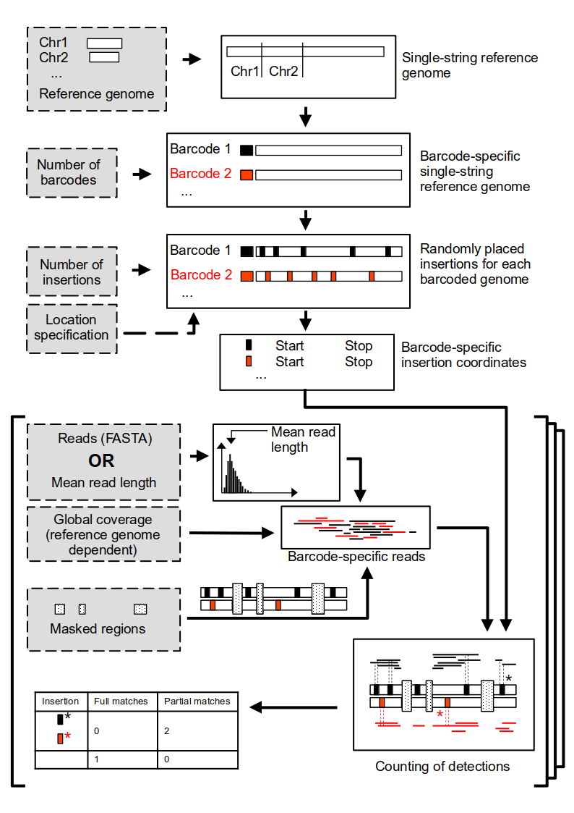

# esloco - Estimating Long-Read Coverage for Whole-Genome Sequencing

> `esloco` is a simulation-based tool designed to help you estimate and optimize long-read DNA sequencing experiments. Whether you're targeting specific regions of interest (ROI) or detecting insertions (I), `esloco` helps you generate realistic estimates of local coverage across regions during whole-genome sequencing.

### Summary

<div style="text-align: center;">
    
</div>

The illustration above demonstrates the workflow of `esloco`, which iteratively uses repeated simulations to estimate DNA sequencing coverage over target regions. The process involves two main steps:

1. **Genome Preparation**: Barcoded genomes are generated by converting the reference genome into single-string formats. Random insertions (`[I]` mode) or user-defined regions of interest (`[ROI]` mode) are assigned.

2. **Read Simulation**: Reads are drawn from a specified length distribution until the desired coverage is achieved. Reads overlapping target regions are counted, while masked regions are excluded. This process is repeated in parallel for multiple iterations to ensure robust coverage estimates.

> [!NOTE]
> The simulation assumes a uniform placement of long-reads during DNA sequencing. Based on the Monte-Carlo method, `esloco` is based on the idea that random sampling can approximate deterministic outcomes, with target coverage primarily influenced by read length distribution and whole-genome coverage.

---

### Installation

The simulation and all its dependencies can be installed using `pip` via

```bash
pip install esloco
```
---

### Usage

Run the simulation on the command line using

```bash
python esloco configfile.ini
```

After the simulation, some basic plots and an interactive overview can be created from the simulation output tables using

```bash
python esloco_plot.py configfile.ini
```

---

### Configuration File

Below are the configuration options for the simulation, divided into three sections: `[COMMON]`, `[ROI]`, and `[I]`.  Mandatory fields marked with **(*)**. 

#### `[COMMON]`

| **Option**                     | **Description**                                                                                     | **Default**                                                                 |
|---------------------------------|-----------------------------------------------------------------------------------------------------|-------------------------------------------------------------------------------------|
| `mode`                         | Running mode; can be `I` or `ROI`. Corresponding section must be provided in the same configuration file.                                                      |          **(*)**                                                                     |
| `reference_genome_path`        | Path to the reference genome .                                                           |         **(*)**                                                                  |
| `sequenced_data_path`          | Custom FASTA file with reads.                                                                      | `None`                                                                          |
| `output_path`                  | Output path for simulation results.                                                                | `./output/`                                                                          |
| `experiment_name`              | Name of the experiment.                                                                             | `default_experiment`                                                                      |
| `output_path_plots`            | Output path for plots.                                                                              | output_path                                                                    |
| `min_overlap_for_detection`    | Minimum overlap required between target region and read to be counted.                             | `1`                                                                                |
| `min_read_lengths`    | Minimum length of reads drawn from the generated or provided read length dsitribution.                             | `1`     |
| `chr_restriction`              | Chromosome restriction; `unrestricted` uses all chromosomes, otherwise excludes "M" or "_" chromosomes. | `None`                                                                             |
| `barcode_weights`              | Changes barcode ratios.                                                                             | `None`                                                                |
| `n_barcodes`                   | Number of barcodes (i.e., genomes).                                                                | `1`                                                                                |
| `iterations`                   | Number of iterations.                                                                               | `1`                                                                                |
| `scaling`                      | Scaling factor; set to `0.5` if insertion/ROI is expected on one allele in a diploid genome.        | `1.0`                                                                                |
| `parallel_jobs`                | Number of cores assigned for parallelization; each job performs one iteration individually.         | `1`                                                                               |
| `coverages`                    | List of coverages used for the simulation.                                                         | `[1]`                                                                      |
| `mean_read_lengths`            | List of mean read lengths used for the simulation; each combination of coverages and lengths is performed per iteration. | `[1000]`                                                              |
| `blocked_regions_bedpath`      | BED file with regions that will be blocked from read generation.                                    | `None`                                                               |
 `no_cov_plots`      | Prevents the simulation from drawing coverage plots during the first iteration. `True` significantly speeds up the simulation for small iteration numbers or high (`>25`) coverages.                                    | `False`                                                               |
 `seed`      | If defined, previous runs can be exactly reproduced.                                    | `random int`    
#### `[ROI]`

| **Option**      | **Description**                     | **Default** |
|------------------|-------------------------------------|---------------------|
| `roi_bedpath`    | BED file with regions of interest. | **(*)**        |

#### `[I]`

| **Option**                     | **Description**                                                                                     | **Default**                                                                 |
|---------------------------------|-----------------------------------------------------------------------------------------------------|-------------------------------------------------------------------------------------|
| `insertion_number_distribution`| Distribution of insertion numbers; if not `poisson`, numbers are fixed.                            | `poisson`                                                                          |
| `insertion_length`             | Length of the inserted sequence.                                                                   | `1000`                                                                            |
| `bedpath`                      | BED file that limits the insertion placement.                                                      | `None`                                               |
| `insertion_numbers`            | Number of insertions; if `insertion_number_distribution=poisson`, this is the mean of the distribution, and the actual number is drawn randomly. | `5`                                                                                |

---

### Simulation output

#### Data

The simulation has four main output files:

1. `{experiment_name}_log.log`: Logs key processes, resources, and debugging information.

2. `{experiment_name}_barcode_distribution_table.csv`: Lists barcode distribution per condition and iteration.

3. `{experiment_name}_matches_table.csv`: Lists detections per ROI/insertion, including overlap details.

    - `[I]`: `Barcode_{Barcode number}_insertion_{insertion number}_{iteration number}` (e.g., Barcode_0_insertion_1_0).

    - `[ROI]`: `{roi}_{Barcode number}_{iteration number}` (e.g., TRGVA_0_0).

4. `{experiment_name}_insertion_locations.bed`: Lists insertion coordinates (Only in `[I]` mode).

#### Figures

During the simulation, basic coverage plots are generated for the first iteration of each parameter set to monitor expected coverage and target region locations.

For a more comprehensive analysis, the `simplot.py {config.ini}` command can generate additional overview plots. These are summarized in an interactive `{experiment_name}_report.html`. Below is an exemplary overview for the figures in the report.

<div style="display: flex; flex-wrap: wrap; gap: 10px;">
    <div>
        <a href="./out/roi_tcr_test/plots/Barplot_absolute_numbers.svg" target="_blank">
            
        </a>
        <p style="text-align: center;">Barplot Absolute Numbers</p>
    </div>
    <div>
        <a href="./out/roi_tcr_test/plots/Barplot_Barcode_absolute_numbers.svg" target="_blank">
            
        </a>
        <p style="text-align: center;">Barplot Barcode Absolute Numbers</p>
    </div>
    <div>
        <a href="./out/roi_tcr_test/plots/lineplot_full_matches.svg" target="_blank">
            
        </a>
        <p style="text-align: center;">Lineplot Full Matches</p>
    </div>
    <div>
        <a href="./out/roi_tcr_test/plots/panel_lineplot_full_matches.svg" target="_blank">
            
        </a>
        <p style="text-align: center;">Panel Lineplot Full Matches</p>
    </div>
    <div>
        <a href="./out/roi_tcr/plots/10000_1_coverage.svg" target="_blank">
            
        </a>
        <p style="text-align: center;">Log Plot</p>
    </div>
    <div>
        <a href="./out/roi_tcr/plots/log_plot.svg" target="_blank">
            
        </a>
        <p style="text-align: center;">Log Plot</p>
    </div>
</div>

---

## Advanced Usage

There are many more potential functionalities of the simulation that can be explored and used to tailor it to a specific experiemntal setup.

##### 0. Custom read length distributions

If there is `FASTA` file provided in the `sequenced_data_path` option of the `configurationfile.ini`, the simulation will use it as its read length distribution, thus dicarding any options provided as `mean_read_lengths`. **Note**: If your read length input files are `.fasta.gz` instead of `.fasta`, decompress them beforehand to improve simulation speed. Command-line tools are generally faster than Python's decompression.

##### 1. Blocked regions `[COMMON]`

If there is a `blocked_regions_bedpath` provided, the simulation will use the locations, as defined by the first three columns (`chr` - `start` - `end`), as well as optional `id` and `weight` columns. The weight column ultimately determines how _strict_ the blocking of the defined region will be performed. if no `weight` is assigned, the default of 1, i.e. 100% will be applied. If only 50% of the reads that fall into this region are supposed to be blocked, `weight` should be set to 0.5.  

##### 2. Chromosome restriction `[COMMON]`

##### 3. Barcode Weighting `[COMMON]`

###### 3.1 Cellular proportions `[COMMON]`

One key feature of the simulation is the option to manually assign weights to individual barcodes, allowing to simulate different cellular compositions. One way toa ssign these weights is directly as a separate entry in the `configurationfile.ini`. Here, `barcode_weights` can be set to any `directory` structure with the `barcode_numbers` as keys and their assigned proportions as values (e.g. `barcode_weights={"0": 10, "1": 5}`). For the example, this means that a read drawn at random is 10 times more likely to be originating from/assigned to barcode 0, compared to barcode 2...n. Also, barcode 1 is also 5 times more likely than the individual barcodes 2...n. **Note:** If only two barcodes, i.e. 0 and 1, are now specified by the `n_barcodes` parameter, this ratio will be scaled to barcode 0 being only 2 times more likely than barcode 1.  

###### 3.2 Selective blocking/masking `[COMMON]`

It is also possible to select barcodes that will be affected by the predefined `blocked_regions_bedpath`. For this, an optional `barcode` column can be added to the bed file, containing a list of barcodes (e.g. ["0", "1"]). **Note**: If the goal is to assign different blocking values to different subsets of barcodes, this can be achieved by adding an `id` column and multiple rows for the same blocked region, which forces the simulation run each set of blocked coordinates individually. 

##### 4. Full chromosome mode `[COMMON]` `[I]` `[ROI]`

Generally, if any of the `BED` files provided contain entries with only a chromosome defined and start and stop set to 0, the simulation will use the full chromosome. 

##### 5. Fixed insertion numbers and/or locations `[I]`

It is also possible to fix the number and/or location of insertions. For this, the `insertion_number_distribution` in the `configurationfile.ini` needs to be set to anything else than `poisson`, which is the default. By doing this, the `insertion_numbers` option will use the defined value as a fixed value, and not as the mean value of a poisson distribution. If the goal is to identify a fixed number of insertions at specific locations, this can be achieved by providing a `bedpath` in the `[I]` section of the `configurationfile.ini`, whhich has the exact same number of entries as `insertion_numbers`.

---
## Wrap it up

Sometimes, multiple back-to-back simulations are required. To handle this, `esloco` can be easily wrapped inside a `bash` loop that processes a directory containing multiple configuration files:

```bash
#!/bin/bash

for config in path/to/configs/*; do
    echo "Processing: $config"
    python esloco "$config"
    python esloco_plot "$config"
done
```

## Citation & Contribution


> [!TIP]
> Helpful advice for doing things better or more easily.

> [!IMPORTANT]
> Key information users need to know to achieve their goal.

> [!WARNING]
> Urgent info that needs immediate user attention to avoid problems.

> [!CAUTION]
> Advises about risks or negative outcomes of certain actions.
